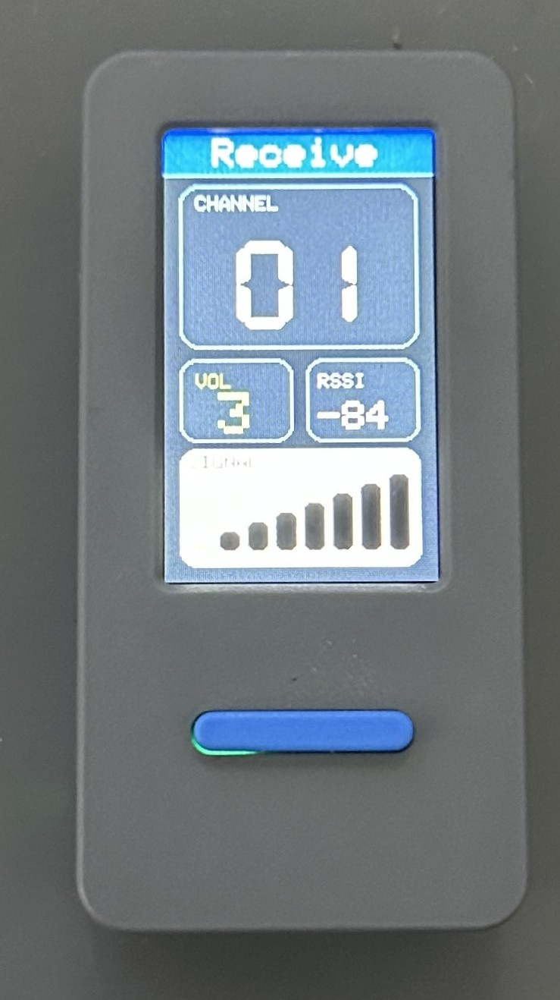

# ESP32Talkie：WiFi音声トランシーバ
M5StickS3で動作する、WiFi音声トランシーバのサンプルコードです。
2.4GHz WiFiで音声通信ができるライセンスフリーのトランシーバで、Espressif社のESP-NOWプロトコルを使用します。

## 仕様
- 送受信周波数：2412～2472MHz（5MHz間隔13波）
- 電波形式：G1D, D1D
- 送信出力：約5mW/MHz
- 受信感度：約-98dBm
- 音声出力：約1.0W
- プロトコル：ESP-NOW Long Range Mode（Espressif）
- 通信距離：最大1km（見通し距離）
- 制御マイコン：M5StickS3
- 電源：リチウムポリマー電池 3.7V, 250mA
- 消費電流：最大XXXmA（送信時）
- その他：ライセンスフリー
- 工事設計認証番号：219-259730

## ビルド
- PlatformIO用のプロジェクトです。
- atomic14氏の [ESP32-walkie-talkie](https://github.com/atomic14/esp32-walkie-talkie) プロジェクトから、`transport` クラスおよび `OutputBuffer` クラスを流用・改造して利用しています。

## 使用方法
- 現在の対象ボードは M5StickS3です。
- 送信音声は8bit 16kHzサンプリングで送受信しています。
- 画面表示
  - 上段: `Receive / Transmit` ステータス
  - 中段: チャンネル2桁表示、`VOL` と `RSSI`
  - 下段: レベルバー（受信時 `SIGNAL` / 送信時 `POWER`）
- 操作:
  - `BtnA`: Push to Talk
  - `BtnB` クリック: `VOL/CH` の現在モード値を変更
  - `BtnB` 長押し: `VOL/CH` モードを切替

## ライセンス
　MIT License

