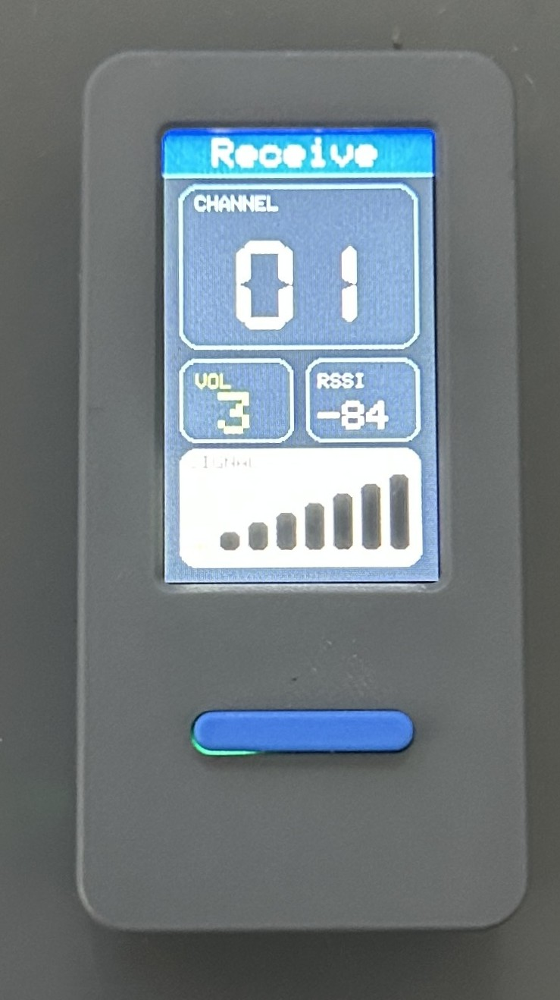
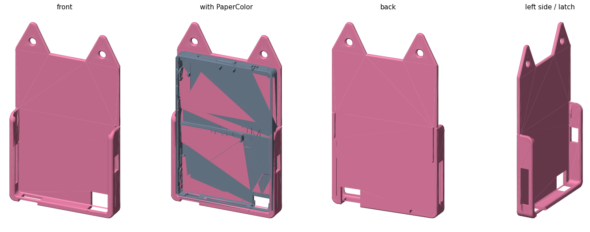

# ESP32Talkie：WiFi音声トランシーバ
M5StickS3、M5AtomS3 + Atomic Echo Base、M5Paper Colorで動作する、WiFi音声トランシーバのサンプルコードです。
2.4GHz WiFiで音声通信ができるライセンスフリーのトランシーバで、Espressif社のESP-NOWプロトコルを使用します。

## 仕様
- 送受信周波数：2412～2472MHz（5MHz間隔13波）
- 電波形式：G1D, D1D
- 送信出力：約5mW/MHz
- 受信感度：約-98dBm
- 音声出力：約1.0W
- プロトコル：ESP-NOW Long Range Mode（Espressif）
- 通信距離：最大1km（見通し距離）
- 制御マイコン：M5StickS3 / M5AtomS3 + Atomic Echo Base / M5Paper Color（いずれもESP32-S3）
- 電源：リチウムポリマー電池 3.7V（M5StickS3: 250mAh、M5Paper Color: 1250mAh）
- 消費電力：最大約１W（送信時）
- その他：ライセンスフリー
- 工事設計認証番号：219-259730

## ビルド
- PlatformIO用のプロジェクトです。
- `platformio.ini` の `default_envs` でビルド対象を選択します。

| 環境名 | 対象機種 |
|---|---|
| `m5stack-sticks3`（デフォルト） | M5StickS3 |
| `m5stack-atoms3-echo-base` | M5AtomS3 + Atomic Echo Base |
| `m5stack-papercolor` | M5Paper Color |

- atomic14氏の [ESP32-walkie-talkie](https://github.com/atomic14/esp32-walkie-talkie) プロジェクトから、`transport` クラスおよび `OutputBuffer` クラスを流用・改造して利用しています。

## 使用方法
- 送信音声は8bit 16kHzサンプリングで送受信しています。
- チャンネル・音量・MODEはNVSに保存され、次回起動時に復元されます。

### M5StickS3 / M5AtomS3 + Atomic Echo Base
- 画面表示
  - 上段: `Receive / Transmit` ステータス
  - 中段: チャンネル2桁表示、`VOL` と `RSSI`
  - 下段: レベルバー（受信時 `SIGNAL` / 送信時 `POWER`）
- 操作:
  - `BtnA`: Push to Talk
  - `BtnA` ダブルクリック: 連続送信の開始/停止（ステータスは `CONT TX`）
  - `BtnB` クリック: `VOL/CH/MODE` の現在モード値を変更
  - `BtnB` 長押し: `VOL/CH/MODE` モードを切替
  - 起動直後は `VOL/CH/MODE` のどれも未選択
  - モード選択は「最後のモード切替または値変更」から5秒後に自動でOFF
  - ふりふり操作（IMU）:
    - 横/縦判定は表示向きに合わせて自動補正
    - 横(X)に振る: 値を上げる
    - 縦(Y)に振る: 値を下げる
    - 奥行き(Z)に振る: `VOL/CH/MODE` モードを切替（M5StickS3では無効）
  - M5AtomS3はボタンが1つ（`BtnA`）のため、設定操作はふりふり操作で行います
  - `MODE`:
    - `M1`: 通常音声
    - `M2`: ケロケロボイス（倍速）
    - `M3`: ケロケロボイス（3倍速）

### 送受信の優先制御（全機種共通）

- 送信中に相手の送信を受けると受信に切替（受信優先）
- 相手の送信中にPTTを押すと割り込み送信（相手側は受信に切替わり、PTT押下中/連続送信中なら割り込み終了後に再開）
- PTT押下中または連続送信中は、相手の受信終了後（300ms + 0〜300msのランダム待ち）に送信を自動再開
- 連続送信: PTTを素早く2回押すと開始、もう一度2回押すと停止（タイムアウトなし）

### M5Paper Color

- `platformio.ini`の対象環境は`m5stack-papercolor`です。
- 通常時は400x600の名札画像を表示し、E-Ink画面は送受信中に更新しません。
- LED表示:
  - 左（電源）: 通電中は緑、バッテリー残量20%以下で点滅
  - 右（送受信）: 受信中は青、送信中は赤、連続送信中は赤点滅、エラー時は橙、待受中は消灯
- 操作:
  - 左上 + 左中ボタン同時押し: 名札画面と設定画面を切替
  - 名札画面
    - 上ボタン: Push to Talk
    - 上ボタン ダブルクリック: 連続送信の開始/停止
    - 左上/左中ボタンの単独操作は無効
  - 設定画面（送信不可）
    - 上ボタン: 設定項目を`CHANNEL → VOLUME → VOICE`の順に切替（選択中の項目を赤枠でハイライト）
    - 左上ボタン: 選択中の値を+1
    - 左中ボタン: 選択中の値を-1
    - 値は範囲端で折り返し（CH 1-13、VOL 1-5、VOICE M1-M3）
    - 画面描画中もキー入力を受け付け、最後の操作から1秒後に保存・再描画
- 設定画面には最終受信時のRSSI（`LAST RX`）も表示します。
- 名札画像は起動時にmicroSDカードのルートの`pokibon-transfer.png`（400x600推奨のPNG）を読み込みます。
  - SDカードが無い、ファイルが無い、読み込み/デコードに失敗した場合は、ファームウェアに埋め込んだ`assets/pokibon-transfer.png`を表示します。
  - 画像を差し替えたら再起動してください。

#### ネックストラップケース（3Dプリント）

- M5Paper Colorを縦置きで首から下げるための猫耳ケースです（`doc/3d/`）。
  - `PaperColor_NekoCase.step` / `PaperColor_NekoCase.stl`: ケース本体
  - `PaperColor_NekoCase_build.py`: CadQueryによる生成スクリプト（寸法パラメータ変更可）
  - `PaperColor.stl`: M5Stack公式の本体モデル（[M5_Hardware](https://github.com/m5stack/M5_Hardware/tree/master/Products/C151_PaperColor/Structures)、MIT License, Copyright (c) 2021 M5Stack。ライセンス全文は`doc/3d/LICENSE_M5Stack_M5_Hardware.txt`）
- 本体は上から差し込み、左右のラッチで固定します。猫耳のφ5mm穴にストラップを通します。
- 上面（上ボタン・マイク・LED）は塞がず、側面ボタン・USB-C・Groveポートは開口しています。
- 背面を下にしてサポートなしで印刷できます。

## バージョン来歴
- v1.0: 新規作成
- v1.1: M5AtomS3 + Atomic Echo Base対応、ケロケロボイス対応
- v1.2: ケロケロボイスモード(M1/M2/M3)追加、ふりふりによるモード/値設定を追加
- v1.3: Wi-Fiをスリープモードにし、消費電力を削減
- v1.4: 音質改善（受信再生の安定化）、パケットフィルタ機能追加
- v1.5: M5Paper Color対応（名札表示・設定画面・LED表示）、連続送信、受信優先/割り込み送信制御、PaperColor用ネックストラップケース

## ライセンス
　MIT License
